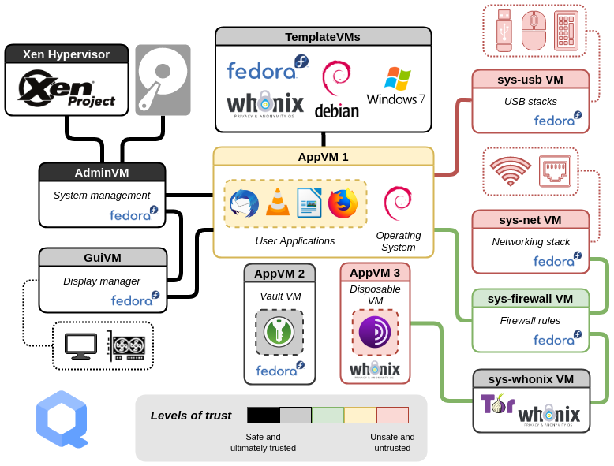

# Qubes OS

En matière de sécurité informatique, nous sommes aujourd'hui dans un statu quo. La plupart des gens gèrent la sécurité de leur données de la même manière : un antivirus et/ou un antimalware, un analyseur d'activité sur le système ou sur le réseau, un proxy, parfois un analyseur DNS pour bloquer des adresses connues à risques. Ces mesures sont passives, avec pour objectif d'identifier et de bloquer les attaques (comme des créneaux d'un château : c'est très efficace, mais parfois l'adversaire passe quand même). Quelques exemples qui démontrent que cette situation ne protège pas à 100% : [Hack de CCleaner en 2017](https://www.kaspersky.fr/resource-center/threats/ccleaner-malware), contenant 2 chevaux de troie; [hack de l'APHP pendant le covid](https://www.aphp.fr/actualites/lap-hp-porte-plainte-suite-une-attaque-informatique-sur-son-service-securise-de-partage#:~:text=L'Assistance%20Publique%20%2D%20H%C3%B4pitaux%20de,confirm%C3%A9e%20le%2012%20septembre%20dernier.).
Nous sommes complétement dépendant de facteurs externes pour nous sécurité, pour lesquels parfois nous payons pour les utiliser. Nous devons nous fier à des antimenaces (antivirus, antimalwares) de sociétés commerciales. Puis nous n'avons pas d'autres lignes de défenses que ces antimenaces à notre disposition. Si notre système est corrompu, nous pouvons au mieux nous adresser à des professionnels, au pire jeter le matériel compromis et tout le matériel à risque, pour repartir d'un matériel propre, nous n'avons aucun levier réactif au niveau software/logiciel.

Ce statu quo est nécessaire mais pas suffisant au regard des menaces d'aujourd'hui. [Qubes](https://www.qubes-os.org/) a été développé dans ce but : offrir un OS assez sécurisé pour affronter les menaces d'aujourd'hui.

<!-- more -->

**Description de Qubes** : 
La philosophie de Qubes est simple : 
- si vous avez le moindre, repartez de zéro,
- diviser pour mieux régner.

Pour chaque niveau de risque, l'OS crée une machine virtuelle dédiée. Par exemple, la navigation sur internet est réalisé dans une machine dédiée classée comme très à risque (en rouge) car très exposée aux menaces, idem pour l'utilisation d'une clé USB. Les logiciels sont installés dans une machine virtuelle classé comme à risque (en jaune), car les logiciels peuvent être hackés (exemple de Ccleaner). Certaines machines virtuels réalisent le core fonctionnement de l'OS et sont donc considérées comme très sûres (en noir). Certaines machines, sans lien extérieures directes sont classé comme sûres et exécutent des fonctions importantes (en gris).
Une machine virtuelle est compromise ? Aucun soucis : suppression pure et simple de la machine virtuelle et donc de tous ses fichiers et logiciels, donc suppression de tout résidu de menace ou de risque de compromission du reste du système. Puis on recrée la machine virtuelle supprimée à partir d'une image d'OS vierge (partie *Template VMs*) pour recréer une machine virtuelle propre et fonctionnelle.

<figure markdown="span">
  
  <figcaption>source : <a href="https://doc.qubes-os.org/en/latest/introduction/intro.html">Architecture de fonctionnement de Qubes OS</a></figcaption>

Grâce à Qubes, chaque secteur logiciel est dans sa propre machine qui ne compromettra pas les autres. Ccleaner est hacké ? Vous supprimez la machine virtuel avec Ccleaner pour supprimer tout risque en lien avec ce hack, et vous repartez d'une nouvelle machine virtuelle pour reconstruire un secteur logiciel avec les applis dont vous avez besoin et sans l'application problématique.

La solution est validée par Edward Snowden et le journal The Economist qui le décrivent comme le meilleur OS en matière de sécurité.  

**En bref** : si la sécurité informatique est un élément central de votre vie, Qubes est l'OS qu'il vous faut et qui répondra à vos attentes. 

A l'heure où la vie en ligne se complexifie avec toujours plus de menaces marketing (récupération sauvage à l'excès de données personnelles) que cybersécurité, Qubes me parait être un OS vers lequel il faut tendre à terme.
L'idée de cette solution est tout simplement fabuleuse à 2 titres : 
- sans perdre sur les capacité défensives passives (vous pouvez réinstaller des antivirus dans les machines virtuelles) l'utilisateur peut supprimer complètement tout trace d'une machine infectée sans avoir à rebooter sans ordinateur de zéro, c'est une innovation importante dans la conception même de ce qu'est un OS,
- l'OS dispose et peut faire tourner en même plusieurs OS (sur l'image : Ubuntu, Fedora, Debian), l'utilisateur peut donc avoir 3 machines virtuels avec 3 OS différents sur sa machine locale, sans avoir à passer par un reboot ou des invocations imbriqués d'OS. Si le système des machines virtuelles le permettaient déjà, Qubes standardise le process.